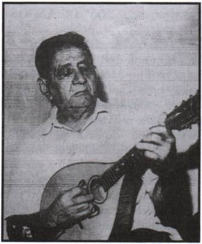
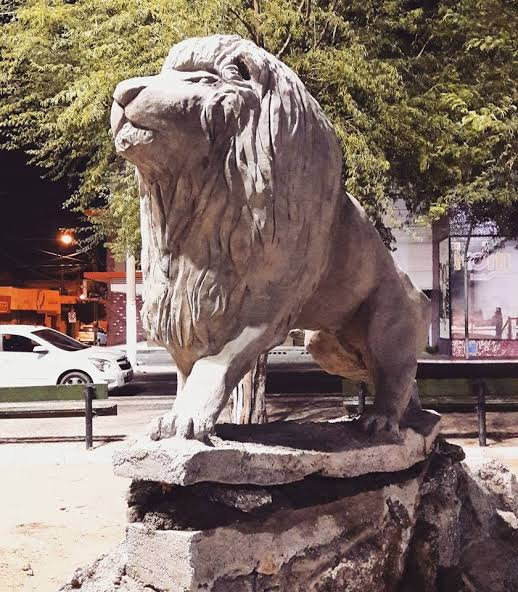

# Projeto em homenagem ao mestre Adolfo de Quixadá
## Leão de Hermes

> Uma ponte virtual entre o passado e o presente, conectando o museu municipal à Praça do Leão através de memórias, vozes e Realidade Aumentada.

### 📖 A História e Inspiração

Este projeto nasce de uma bela tradição de Quixadá e da genialidade de **Adolfo Lopes da Costa**, carinhosamente conhecido como Mestre Adolfo ou Cego Adolfo. Um homem de inteligência excepcional que, mesmo sem o sentido da visão, dominava a mecânica, a eletrônica e arrancava emoções com seu bandolim. 

Associando seu dom musical à eletrônica, Adolfo instalou e comandou por cinco décadas o icônico **Serviço de Alto-Falantes Solon Magalhães**. Através de uma possante irradiadora construída por ele mesmo, um som puro e cristalino cobria os principais pontos da cidade, divulgando notícias, convites e, principalmente, canções românticas da "fase de ouro" da Música Popular Brasileira. 

Foi nesse cenário que nasceu uma tradição: os homens da cidade iam até o serviço de Mestre Adolfo pedir para anunciar nos grandes alto-falantes da praça que estavam esperando suas esposas e amadas. Hoje, o microfone original utilizado nessas transmissões históricas repousa no museu. O nosso projeto revive essa magia, transformando esse artefato em um portal interativo de afeto.

### 🦁 O Significado do Nome

O título da obra une duas referências:
* **Leão:** Uma conexão geográfica direta à **Praça do Leão**, o grande palco das declarações apaixonadas originais e o destino final da nossa experiência imersiva.
* **Hermes:** Na mitologia grega, Hermes é o deus mensageiro, padroeiro dos viajantes e das comunicações. Assim como ele, e assim como o serviço de alto-falantes de Mestre Adolfo, a nossa aplicação capta a voz no museu e a transporta de forma invisível até quem está na praça.

### ⚙️ Como Funciona a Experiência
O projeto é dividido em duas etapas que exigem a presença física do usuário nos locais históricos da cidade:

1. **O Ponto de Partida (Museu):** Ao lado do microfone original de Mestre Adolfo, o visitante acessa uma interface web via QR Code. Nela, um gravador interativo permite registrar uma declaração, uma lembrança ou um recado em áudio.
   
2. **O Destino (Praça do Leão):**
   A mensagem gravada não toca no museu. Para ouvi-la, é preciso se deslocar até a Praça do Leão. Pelo navegador do celular, o sistema valida a localização via GPS e, usando Realidade Aumentada (AR), projeta grandes caixas de som em 3D no ambiente físico. Ao iniciar a experiência, o usuário ouve uma *playlist* em loop com os áudios e anúncios deixados pelos visitantes do museu, recriando a atmosfera do antigo "Solon Magalhães".

### 💻 Tecnologias Utilizadas
Para dar vida a essa experiência de *Location-Based AR* (Realidade Aumentada Baseada em Localização), utilizamos uma arquitetura web moderna, dispensando o download de aplicativos:

  
  
  
  

### 📚 Referências e Saiba Mais
A fundamentação histórica sobre a vida e obra de Adolfo Lopes da Costa (Mestre Adolfo), utilizada como inspiração para este projeto, foi retirada do livro:

* **Obra:** *SOCIEDADE DE ASSISTÊNCIA AOS CEGOS - 60 ANOS: Ensinando a Ver o Mundo*
* **Autor:** Blanchard Girão
* **Páginas:** 114 a 122
* **Acesse para mais informações:** [Site Oficial - Instituto SAC](http://www.sac.org.br/instituto/60_anos_114.htm)

---
*Desenvolvido como um trabalho acadêmico unindo Realidade Virtual, preservação histórica e storytelling interativo.*